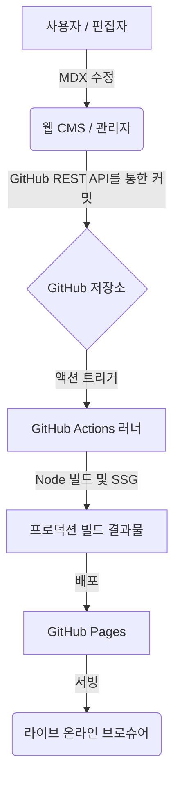

# PNU Slate: 차세대 온라인 브로슈어 CMS

[](https://opensource.org/licenses/MIT)
[](https://docusaurus.io/)
[](https://react.dev/)

PNU Slate는 부산대학교 AI융합교육원의 다양한 교육 프로그램을 체계적으로 관리하고 배포하기 위한 통합 디지털 브로슈어 플랫폼입니다. Docusaurus 기반의 정적 사이트 생성(SSG) 기술과 Git 기반의 무설치형 Web CMS를 결합하여 개발 생산성과 운영 편의성을 동시에 제공합니다.

---

## 시스템 아키텍처

본 프로젝트는 **Decoupled Git-based CMS** 구조를 따릅니다. 관리자 인터페이스를 통해 수정된 콘텐츠는 GitHub REST API를 통해 저장소에 직접 동기화되며, 즉시 자동화된 CI/CD 파이프라인을 트리거합니다.



---

## 핵심 기능

### PNU AI Hub 
**[PNU AI Hub](https://pnuai.github.io)**는 전체 시스템의 메인 게이트웨이 역할을 수행합니다.

통합 접근 지점: 별도의 리포지토리로 관리되는 개별 교육 과정(부트캠프, 대학원, 교원 연수 등) 브로슈어를 한곳에서 탐색하고 접근할 수 있는 인덱스 기능을 제공합니다.

중앙 집중형 라우팅: 각 프로그램의 상세 페이지와 Slate 엔진 기반의 프로젝트들을 유기적으로 연결하여 사용자 경험의 일관성을 유지합니다.

### Web CMS 
/admin 경로를 통해 제공되는 관리자 인터페이스는 기술적 지식이 부족한 운영자도 고성능 콘텐츠를 관리할 수 있도록 설계되었습니다.

문서 라이프사이클 제어: 신규 MDX 문서 생성, 기존 문서의 실시간 수정 및 삭제를 지원합니다.

순서 및 구조 관리: 드래그 앤 드롭 또는 파일명 프리픽스 제어를 통해 사이드바 및 챕터 노출 순서를 GUI 상에서 즉시 변경할 수 있습니다.

실시간 위지윅(WYSIWYG) 편집: 커스텀 React 컴포넌트(Columns, Highlight 등)가 적용된 결과물을 미리보며 편집할 수 있습니다.

자동화된 배포 연동: 저장 시 GitHub API를 호출하여 소스 코드를 업데이트하며, 이는 곧바로 CI/CD 빌드로 이어집니다.

- **프리미엄 MDX 컴포넌트**: 다단 레이아웃(Columns), 단계별 블록(Phase Blocks), 데이터 시각화 등 브로슈어에 특화된 커스텀 React 컴포넌트 제공.
- **제로-설정 CMS**: 별도의 로컬 환경 없이 `/admin` 경로를 통해 즉시 접속 가능한 관리자 포탈. 실제 디자인과 100% 일치하는 실시간 미리보기 지원.
- **자동 CI/CD 파이프라인**: GitHub Actions와의 연동을 통해 저장 버튼 클릭 한 번으로 자동 빌드 및 배포.
- **고성능 SSG**: Docusaurus 3 기반의 정적 사이트 생성으로 압도적인 페이지 로딩 속도와 SEO 최적화.
- **지능형 UX**: 스크롤 추적 목차(Scroll-Spy TOC), 부드러운 전환 효과, 마케팅에 최적화된 반응형 레이아웃.

---

## 기술 스택 상세 (Tech Stack)

이 프로젝트는 최신 라이브러리와 프레임워크를 기반으로 구축되었습니다.

| 분류 | 컴포넌트 | 상세 버전 |
| :--- | :--- | :--- |
| **코어 프레임워크** | **React** | **v19.0.0** |
| **사이트 엔진** | **Docusaurus** | **v3.10.1** (Faster 모드 적용) |
| **콘텐츠 엔진** | **MDX** | **v3.0.0** |
| **스타일링** | Vanilla CSS3 | Infima 테마 엔진 (Customized) |
| **관리자 UI** | Vanilla JS | Toast UI Editor 기반 CMS |
| **빌드/배포** | GitHub Actions | Node.js v20 LTS 환경 |

---

## 시작하기

### 사전 준비 사항
- Node.js >= 20.0
- npm 또는 yarn

### 로컬 개발 환경 설정
1. **저장소 클론 및 패키지 설치**:
   ```bash
   git clone https://github.com/pnuai/pnu-slate.git
   cd pnu-slate
   npm install
   ```
2. **개발 서버 실행**:
   ```bash
   npm run start
   ```
   브라우저에서 `http://localhost:3000` 접속 시 실시간 확인이 가능합니다.

3. **프로덕션 빌드**:
   ```bash
   npm run build
   ```

---

## 디렉토리 구조

```text
pnu-slate/
├── .github/workflows/    # CI/CD 자동화 (빌드 및 GitHub Pages 배포)
├── blog/                 # 공지사항 및 포스트 데이터 (MDX)
├── docs/                 # 교육 과정별 핵심 콘텐츠 (숫자 기반 정렬 관리)
├── scripts/              # 빌드 타임 자동화 도구
│   └── generateChapters.mjs  # 문서 구조 기반의 챕터 데이터 자동 추출 스크립트
├── src/                  # 프론트엔드 핵심 소스
│   ├── components/       # 브로슈어 전용 React 컴포넌트 (Columns, HeroButton 등)
│   ├── css/              # 브랜드 가이드라인 기반 전역 스타일 정의
│   ├── data/             # 런타임 데이터 (자동 생성된 chapters.generated.js 등)
│   ├── pages/            # 허브 랜딩 페이지 및 정적 페이지
│   └── theme/            # Docusaurus 테마 커스텀 및 레이아웃 정의
├── static/               # 정적 자원 및 관리자 모듈
│   └── admin/            # Web CMS 클라이언트 소스 (index.html, JS)
├── docusaurus.config.js  # 글로벌 환경 설정 및 플러그인 관리
└── sidebars.js           # 문서 계층 및 탐색(Navigation) 규칙 정의
```

---

## 사용자 가이드

웹 CMS 사용법, GitHub 토큰 설정 방법, 디자인 템플릿 활용법 등 일반 사용자를 위한 상세 안내는 아래 가이드북을 참고하세요.

👉 **[USER_GUIDE.md (사용자 가이드 바로가기)](./USER_GUIDE.md)**

---

## 라이선스

본 프로젝트는 [MIT License](LICENSE)를 따릅니다.

&copy; 2026 Pusan National University AI Convergence Education Institute.
