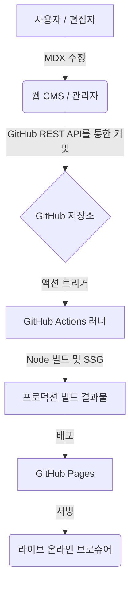

# 💎 PNU Slate: 차세대 온라인 브로슈어 CMS

[](https://opensource.org/licenses/MIT)
[](https://docusaurus.io/)
[](https://react.dev/)

**PNU Slate**는 **부산대학교 AI융합교육원**을 위해 설계된 고성능 프리미엄 온라인 브로슈어 플랫폼입니다. **Docusaurus 3**의 강력한 정적 사이트 생성 기능과 자체 개발한 **Git 기반 웹 CMS**를 결합하여, 코딩 지식이 없는 사용자도 전문적인 디지털 콘텐츠를 손쉽게 관리하고 배포할 수 있도록 지원합니다.

---

## 🏗 시스템 아키텍처

본 프로젝트는 **Decoupled Git-based CMS** 구조를 따릅니다. 관리자 인터페이스를 통해 수정된 콘텐츠는 GitHub REST API를 통해 저장소에 직접 동기화되며, 즉시 자동화된 CI/CD 파이프라인을 트리거합니다.



---

## ✨ 핵심 기능

- **프리미엄 MDX 컴포넌트**: 다단 레이아웃(Columns), 단계별 블록(Phase Blocks), 데이터 시각화 등 브로슈어에 특화된 커스텀 React 컴포넌트 제공.
- **제로-설정 CMS**: 별도의 로컬 환경 없이 `/admin` 경로를 통해 즉시 접속 가능한 관리자 포탈. 실제 디자인과 100% 일치하는 실시간 미리보기 지원.
- **자동 CI/CD 파이프라인**: GitHub Actions와의 연동을 통해 저장 버튼 클릭 한 번으로 자동 빌드 및 배포.
- **고성능 SSG**: Docusaurus 3 기반의 정적 사이트 생성으로 압도적인 페이지 로딩 속도와 SEO 최적화.
- **지능형 UX**: 스크롤 추적 목차(Scroll-Spy TOC), 부드러운 전환 효과, 마케팅에 최적화된 반응형 레이아웃.

---

## 🛠 기술 스택 상세 (Tech Stack)

이 프로젝트는 최신 라이브러리와 프레임워크를 기반으로 구축되었습니다.

| 분류 | 컴포넌트 | 상세 버전 |
| :--- | :--- | :--- |
| **코어 프레임워크** | **React** | **v19.0.0** |
| **사이트 엔진** | **Docusaurus** | **v3.10.1** (Faster 모드 적용) |
| **콘텐츠 엔진** | **MDX** | **v3.0.0** |
| **스타일링** | Vanilla CSS3 | Infima 테마 엔진 (Customized) |
| **관리자 UI** | Vanilla JS | Toast UI Editor 기반 CMS |
| **빌드/배포** | GitHub Actions | Node.js v20 LTS 환경 |

---

## 🚀 시작하기

### 사전 준비 사항
- Node.js >= 20.0
- npm 또는 yarn

### 로컬 개발 환경 설정
1. **저장소 클론 및 패키지 설치**:
   ```bash
   git clone https://github.com/pnuai/pnu-slate.git
   cd pnu-slate
   npm install
   ```
2. **개발 서버 실행**:
   ```bash
   npm run start
   ```
   브라우저에서 `http://localhost:3000` 접속 시 실시간 확인이 가능합니다.

3. **프로덕션 빌드**:
   ```bash
   npm run build
   ```

---

## 📁 디렉토리 구조

```text
├── docs/                 # MDX 형식의 실제 콘텐츠 저장소
├── src/
│   ├── components/       # 재사용 가능한 React UI 컴포넌트
│   ├── theme/            # 테마 스위즐링 (MDX 등록 및 레이아웃 커스텀)
│   └── data/             # 네비게이션 구성을 위한 자동 생성 메타데이터
├── static/
│   └── admin/            # 웹 CMS 소스코드 (HTML/JS/CSS)
├── scripts/              # 빌드 타임 자동화 스크립트
└── docusaurus.config.js  # 글로벌 프로젝트 설정 파일
```

---

## 📘 사용자 가이드

웹 CMS 사용법, GitHub 토큰 설정 방법, 디자인 템플릿 활용법 등 일반 사용자를 위한 상세 안내는 아래 가이드북을 참고하세요.

👉 **[USER_GUIDE.md (사용자 가이드 바로가기)](./USER_GUIDE.md)**

---

## 📄 라이선스

본 프로젝트는 [MIT License](LICENSE)를 따릅니다.

&copy; 2026 Pusan National University AI Convergence Education Institute.
