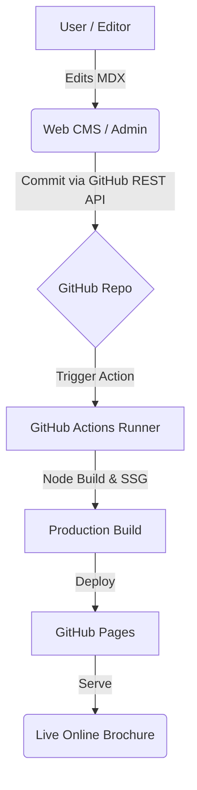

# 💎 PNU Slate: Next-Gen Online Brochure CMS

[](https://opensource.org/licenses/MIT)
[](https://docusaurus.io/)
[](https://react.dev/)

**PNU Slate** is a high-performance, aesthetically driven online brochure platform designed for the **Pusan National University AI Convergence Education Center**. It combines the static-site power of **Docusaurus 3** with a custom-built, Git-based **Web CMS** to empower non-developers to manage premium digital content with zero coding knowledge.

---

## 🏗 System Architecture

The project follows a **Decoupled Git-based CMS** architecture. Content is managed via a web interface and synchronized directly with the GitHub repository, triggering automated CI/CD pipelines.



---

## ✨ Key Features

- **Premium MDX Components**: Custom-built React components for multi-column layouts, phase blocks, and high-impact data visualizations.
- **Zero-Setup CMS**: A built-in administrator portal (`/admin`) that supports real-time previews with 100% design fidelity.
- **Automated CI/CD**: Seamless integration with GitHub Actions for one-click deployment.
- **High-Performance SSG**: Powered by Docusaurus 3 for lightning-fast page loads and optimized SEO.
- **Dynamic UX**: Features like Scroll-Spy TOC, smooth transitions, and responsive design tailored for marketing brochures.

---

## 🛠 Tech Stack

| Category | Technology |
| :--- | :--- |
| **Core Framework** | [Docusaurus 3.x](https://docusaurus.io/), React 19 |
| **Styling** | Vanilla CSS3, Infima Theme Engine |
| **Admin Portal** | Vanilla JS, Toast UI Editor, HTML5 |
| **Infrastructure** | GitHub REST API, GitHub Actions, GitHub Pages |
| **Content Format** | MDX (Markdown + JSX) |

---

## 🚀 Getting Started

### Prerequisites
- Node.js >= 20.0
- npm or yarn

### Local Development
1. **Clone & Install**:
   ```bash
   git clone https://github.com/pnuai/pnu-slate.git
   cd pnu-slate
   npm install
   ```
2. **Start Development Server**:
   ```bash
   npm run start
   ```
   Access the site at `http://localhost:3000`.

3. **Build for Production**:
   ```bash
   npm run build
   ```

---

## 📁 Repository Structure

```text
├── docs/                 # Source content in MDX format
├── src/
│   ├── components/       # Reusable React UI components
│   ├── theme/            # Theme swizzling (MDX registration, layout)
│   └── data/             # Generated metadata for navigation
├── static/
│   └── admin/            # The Web CMS (HTML/JS/CSS)
├── scripts/              # Build-time automation scripts
└── docusaurus.config.js  # Global project configuration
```

---

## 📘 Documentation for Users

For detailed instructions on how to use the **Web CMS**, manage **GitHub Tokens**, and use **Design Templates**, please refer to our comprehensive Guidebook:

👉 **[Go to USER_GUIDE.md (사용자 가이드 바로가기)](./USER_GUIDE.md)**

---

## 📄 License

This project is licensed under the [MIT License](LICENSE).

&copy; 2026 Pusan National University AI Convergence Education Center.
